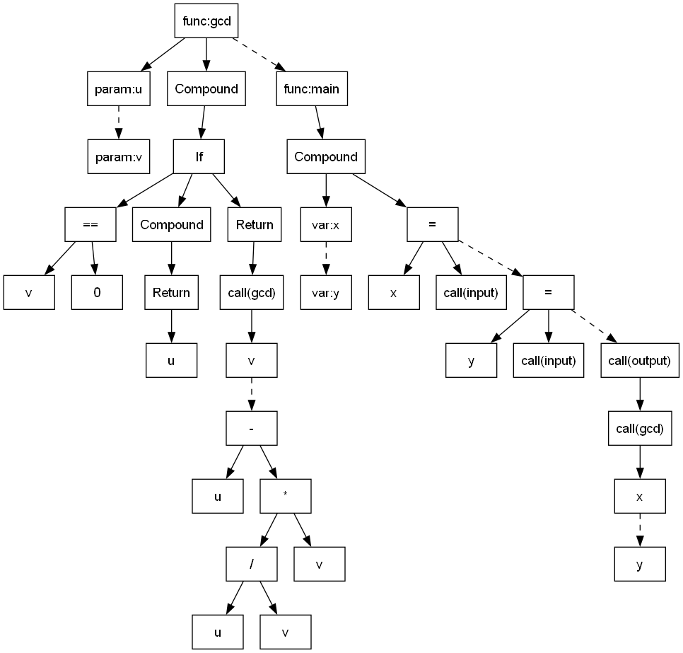
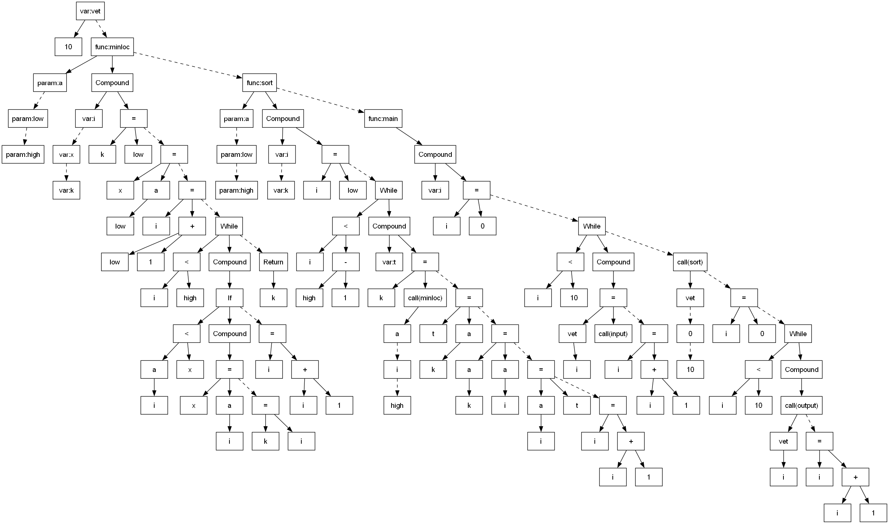

# Implementação do Compilador C-

**Nome do aluno:** [PREENCHER]  
**Professor:** Prof. Dr. Luiz Eduardo Galvão Martins  
**Disciplina:** Laboratório de Sistemas Computacionais: Compiladores  
**Universidade:** Universidade Federal de São Paulo  
**Local:** [PREENCHER]  
**Data:** Junho de 2026

Relatório apresentado à Universidade Federal de São Paulo como parte dos requisitos para aprovação na disciplina de Laboratório de Sistemas Computacionais: Compiladores.

\newpage

## Índice

1. [Introdução](#1-introdução)  
2. [O Processador](#2-o-processador)  
3. [Compilador: Fase de Análise](#3-compilador-fase-de-análise)  
4. [Compilador: Fase de Síntese](#4-compilador-fase-de-síntese)  
5. [Exemplos](#5-exemplos)  
6. [Conclusão](#6-conclusão)  
7. [Referências](#7-referências)  
8. [Lista de Figuras a Inserir](#8-lista-de-figuras-a-inserir)

\newpage

## 1. Introdução

Compiladores são sistemas responsáveis por traduzir programas escritos em uma linguagem de alto nível para uma representação executável por uma máquina alvo. Essa tradução envolve etapas de análise e síntese: inicialmente o código fonte é reconhecido, estruturado e validado; em seguida, ele é transformado em código intermediário, assembly e, por fim, código binário.

O projeto desenvolvido na disciplina consiste na implementação de um compilador para a linguagem C-, uma linguagem inspirada na linguagem C, porém com um conjunto reduzido de construções. O compilador implementado reconhece declarações de variáveis, vetores, funções, parâmetros, comandos condicionais, comandos de repetição, chamadas de função, entrada e saída, operadores aritméticos e operadores relacionais. Além disso, o projeto inclui a geração de código assembly para um processador RISC-V customizado e a geração de código executável em formato hexadecimal para inicialização da memória de instruções.

O compilador não foi desenvolvido apenas como uma ferramenta isolada. Ele foi integrado a um processador RISC-V implementado em Verilog HDL, sintetizável no Quartus e simulável no ModelSim. Dessa forma, o fluxo completo do projeto parte de um programa C-, gera a árvore sintática, a tabela de símbolos, o código intermediário, o assembly, o arquivo hexadecimal e executa o resultado no processador.

Este relatório está organizado da seguinte forma. O Capítulo 2 apresenta o processador utilizado como máquina alvo. O Capítulo 3 descreve as fases de análise do compilador. O Capítulo 4 descreve as fases de síntese, com ênfase na geração de código intermediário, assembly e binário. O Capítulo 5 apresenta exemplos de uso do compilador. Por fim, o Capítulo 6 discute dificuldades, destaques e trabalhos futuros.

## 2. O Processador

### 2.1 Diagrama de Blocos do Processador

> [INSERIR FIGURA 1: Diagrama de blocos do processador RISC-V. Sugestão: exportar do relatório do processador ou do Quartus/ModelSim para `Relatório Final/imagens/processador_blocos.png`.]

O processador utilizado como alvo do compilador é uma implementação RISC-V customizada em Verilog HDL. Ele segue uma organização de caminho de dados com contador de programa, memória de instruções, unidade de controle, banco de registradores, ULA, unidade de multiplicação/divisão, memória de dados e interface de entrada e saída mapeada em memória.

A execução dos programas gerados pelo compilador ocorre por meio da memória de instruções inicializada com um arquivo hexadecimal. O compilador gera assembly RISC-V e o montador converte esse assembly para o arquivo `program.hex`, utilizado pelo módulo `instruction_memory.v` por meio de `$readmemh`.

### 2.2 Componentes do Processador

Os principais componentes do processador são:

- **Program Counter (PC):** armazena o endereço da instrução atual e é atualizado a cada ciclo de clock.
- **Memória de instruções:** armazena o programa em formato binário hexadecimal. A memória é inicializada pelo arquivo `program.hex`.
- **Unidade de controle:** decodifica `opcode`, `funct3` e `funct7`, gerando sinais como `RegWrite`, `MemRead`, `MemWrite`, `ALUSrc`, `Branch`, `Jump` e `ALUControl`.
- **Banco de registradores:** implementa 32 registradores de 32 bits. O registrador `x0` é mantido constante em zero, como especificado pela arquitetura RISC-V.
- **ULA:** executa operações aritméticas e lógicas, como soma, subtração, comparação, deslocamento e operações booleanas.
- **Unidade de multiplicação/divisão:** executa instruções da extensão M, como `mul`, `div` e `rem`.
- **Memória de dados:** armazena variáveis globais, vetores e pilha de execução.
- **Interface de entrada e saída:** utiliza endereços mapeados em memória para representar `input()` e `output()`.

### 2.3 Conjunto de Instruções

O processador implementa um subconjunto RV32I com parte da extensão M. O compilador foi projetado para emitir apenas instruções suportadas pela máquina alvo.

| Classe | Instruções utilizadas | Finalidade |
|---|---|---|
| Tipo R | `add`, `sub`, `slt`, `xor`, `sll`, `mul`, `div` | Operações entre registradores |
| Tipo I | `addi`, `slti`, `xori`, `lw`, `jalr` | Imediatos, leitura de memória e retorno de função |
| Tipo S | `sw` | Escrita em memória |
| Tipo B | `beq`, `bne`, `blt`, `bge` | Desvios condicionais |
| Tipo J | `jal` | Chamadas e desvios incondicionais |

Embora o conjunto de instruções seja menor que o RISC-V completo, ele é suficiente para implementar as construções da linguagem C- exigidas no projeto: atribuições, expressões aritméticas, expressões relacionais, condicionais, laços, chamadas de função, recursão, vetores e entrada/saída.

### 2.4 Organização da Memória

A memória do sistema foi organizada com 8192 bytes, divididos em palavras de 32 bits. O compilador inicializa o ponteiro de pilha (`x2`) no topo da memória, em torno do endereço 8188, e utiliza crescimento descendente para armazenar variáveis locais, temporários, parâmetros, registrador de retorno e frame pointer.

Os principais registradores convencionados são:

| Registrador | Uso |
|---|---|
| `x0` | Constante zero |
| `x1` | Endereço de retorno (`ra`) |
| `x2` | Ponteiro de pilha (`sp`) |
| `x8` | Frame pointer (`fp`) |
| `t0`, `t1`, `t2` | Registradores temporários usados na geração de assembly |

A entrada e a saída são mapeadas em memória:

| Endereço | Função |
|---|---|
| `2044` | Entrada de dados, usada por `input()` |
| `2040` | Saída de dados, usada por `output()` |

Vetores globais são alocados a partir da região inicial da memória de dados. Vetores passados como parâmetro são tratados como endereços-base, permitindo que funções como `sort(int a[])` e `minloc(int a[])` acessem e modifiquem o vetor original.

## 3. Compilador: Fase de Análise

### 3.1 Modelagem

#### 3.1.1 Diagrama de Blocos SysML

> [INSERIR FIGURA 2: Diagrama de blocos SysML do compilador. Sugestão: exportar do arquivo `modelagem/MODELAGENS SYSML.pdf` para `Relatório Final/imagens/sysml_blocos_compilador.png`.]

O diagrama de blocos representa a decomposição do compilador em módulos funcionais. A estrutura geral contém o analisador léxico, o analisador sintático, o analisador semântico, a tabela de símbolos, o gerador de código intermediário, o gerador de assembly e o montador para código executável.

#### 3.1.2 Diagramas de Atividades SysML

> [INSERIR FIGURA 3: Diagrama de atividade da fase de análise. Sugestão: exportar para `Relatório Final/imagens/sysml_atividade_analise.png`.]

O fluxo da fase de análise começa com a leitura do arquivo fonte C-. O analisador léxico divide o texto em tokens. Em seguida, o analisador sintático verifica a estrutura gramatical e constrói a árvore sintática. Por fim, o analisador semântico percorre a árvore, preenche a tabela de símbolos e verifica erros relacionados a escopo, declarações e uso de identificadores.

### 3.2 Análise Léxica

A análise léxica foi implementada com Flex, no arquivo `src/lexer.l`. Essa fase transforma a sequência de caracteres do programa fonte em tokens. Os principais tokens reconhecidos são:

- palavras-chave: `if`, `else`, `while`, `return`, `int`, `void`;
- identificadores;
- números inteiros;
- operadores aritméticos: `+`, `-`, `*`, `/`;
- operadores relacionais: `<`, `<=`, `>`, `>=`, `==`, `!=`;
- operador de atribuição: `=`;
- delimitadores: `(`, `)`, `{`, `}`, `[`, `]`, `;`, `,`;
- comentários de bloco no formato `/* ... */`.

Quando um símbolo inválido é encontrado, o analisador léxico informa a linha do erro. Essa etapa é essencial porque simplifica a entrada para o analisador sintático e evita que caracteres desconhecidos cheguem às fases posteriores.

### 3.3 Análise Sintática

A análise sintática foi implementada com Bison, no arquivo `src/sintax.y`. Ela reconhece a gramática da linguagem C- e constrói uma árvore sintática abstrata. A AST representa a estrutura do programa sem guardar todos os detalhes textuais do código fonte.

Entre as construções reconhecidas estão:

- declarações de variáveis simples;
- declarações de vetores;
- declarações de funções;
- parâmetros simples e vetoriais;
- comandos compostos;
- atribuições;
- comandos `if`, `if/else` e `while`;
- comandos `return`;
- chamadas de função;
- expressões aritméticas e relacionais.

A árvore sintática é impressa em formato DOT, permitindo sua visualização com Graphviz. O projeto já contém imagens de árvores geradas para exemplos como `gcd`, `sort` e `fatorial`.





### 3.4 Análise Semântica

A análise semântica utiliza a tabela de símbolos para validar o uso dos identificadores. A tabela registra nome, escopo, tipo de identificador, tipo de dado, localização e linhas de ocorrência. Essa estrutura permite detectar erros como uso de variáveis não declaradas, conflitos de declaração e inconsistências relacionadas a funções, variáveis e vetores.

O controle de escopo permite diferenciar símbolos globais, símbolos locais de funções e símbolos declarados dentro de blocos internos. Isso é importante para a linguagem C-, pois funções como `sort` e `minloc` declaram variáveis locais com nomes iguais em escopos diferentes.

## 4. Compilador: Fase de Síntese

### 4.1 Modelagem

#### 4.1.1 Diagrama de Blocos SysML

> [INSERIR FIGURA 4: Diagrama de blocos da fase de síntese. Sugestão: exportar para `Relatório Final/imagens/sysml_blocos_sintese.png`.]

A fase de síntese recebe como entrada a árvore sintática validada e a tabela de símbolos. A partir dessas estruturas, o compilador gera quádruplas, traduz as quádruplas para assembly RISC-V e converte o assembly para código hexadecimal.

#### 4.1.2 Diagramas de Atividades SysML

> [INSERIR FIGURA 5: Diagrama de atividade da geração de código intermediário. Sugestão: exportar para `Relatório Final/imagens/sysml_atividade_intermediario.png`.]

> [INSERIR FIGURA 6: Diagrama de atividade da geração de assembly e binário. Sugestão: exportar para `Relatório Final/imagens/sysml_atividade_assembly_binario.png`.]

### 4.2 Geração do Código Intermediário

O código intermediário é representado por quádruplas no formato:

```text
(op, arg1, arg2, result)
```

Cada quádrupla representa uma operação simples. Essa representação facilita a separação entre a análise da linguagem fonte e a geração de código para a arquitetura alvo.

Os principais tipos de quádruplas são:

| Quádrupla | Significado |
|---|---|
| `(FUN, tipo, nome, -)` | Início de função |
| `(END, nome, -, -)` | Fim de função |
| `(ASSIGN, val, -, dest)` | Atribuição |
| `(ADD, a, b, dest)` | Soma |
| `(SUB, a, b, dest)` | Subtração |
| `(MULT, a, b, dest)` | Multiplicação |
| `(DIV, a, b, dest)` | Divisão |
| `(LT, a, b, dest)` | Comparação menor que |
| `(LE, a, b, dest)` | Comparação menor ou igual |
| `(GT, a, b, dest)` | Comparação maior que |
| `(GE, a, b, dest)` | Comparação maior ou igual |
| `(EQ, a, b, dest)` | Comparação de igualdade |
| `(NEQ, a, b, dest)` | Comparação de diferença |
| `(IFF, cond, label, -)` | Desvio se a condição for falsa |
| `(GOTO, label, -, -)` | Desvio incondicional |
| `(LAB, label, -, -)` | Definição de rótulo |
| `(PARAM, arg, -, -)` | Passagem de parâmetro |
| `(CALL, func, nargs, dest)` | Chamada de função |
| `(RET, val, -, -)` | Retorno de função |
| `(LOAD, vet, idx, dest)` | Leitura de vetor |
| `(STORE, val, idx, vet)` | Escrita em vetor |
| `(ALLOC, vet, tam, -)` | Reserva de vetor global |

As quádruplas são armazenadas em lista encadeada, permitindo que o gerador de assembly percorra a sequência na mesma ordem em que o programa deve ser executado.

### 4.3 Geração do Código Assembly

O módulo de geração de assembly está implementado em `src/asmgen.c`. Ele percorre a lista de quádruplas e emite instruções RISC-V compatíveis com o processador desenvolvido.

A geração de assembly utiliza uma convenção simples de chamada de função:

- o registrador `x2` é usado como ponteiro de pilha;
- o registrador `x8` é usado como frame pointer;
- os parâmetros são empilhados pelo chamador;
- antes da chamada, o chamador salva `fp` e `ra`;
- a função chamada cria seu frame local;
- o retorno é colocado em registrador temporário e salvo no destino indicado pela quádrupla;
- após a chamada, o chamador restaura `ra`, `fp` e remove os parâmetros da pilha.

Exemplo de tradução de chamada de função:

```text
(PARAM, x, -, -)
(PARAM, y, -, -)
(CALL, gcd, 2, _t18)
```

gera uma sequência conceitual:

```asm
lw   t0, offset_x(x8)
addi x2, x2, -4
sw   t0, 0(x2)

lw   t0, offset_y(x8)
addi x2, x2, -4
sw   t0, 0(x2)

addi x2, x2, -4
sw   x8, 0(x2)
addi x2, x2, -4
sw   x1, 0(x2)
jal  x1, gcd
lw   x1, 0(x2)
lw   x8, 4(x2)
addi x2, x2, 8
addi x2, x2, 8
```

As operações aritméticas e relacionais são traduzidas para instruções da ULA. Por exemplo, uma quádrupla `ADD` gera `add`, uma quádrupla `SUB` gera `sub`, `MULT` gera `mul` e `DIV` gera `div`. Comparações como `==` e `!=` são implementadas com combinações de `xor`, `slti` e `xori`.

A entrada e a saída são tratadas como funções especiais:

```c
x = input();
output(x);
```

O assembly gerado utiliza os endereços mapeados em memória:

```asm
lw   t0, 2044(x0)  # input
sw   t0, 2040(x0)  # output
```

### 4.4 Geração do Código Executável

A geração do código executável é feita pelo script `RISC-V/sinteses/asm_to_hex.py`. Esse script monta o assembly gerado pelo compilador e produz um arquivo hexadecimal compatível com `$readmemh`.

O fluxo é:

```powershell
.\compilador.exe .\testes\sort.cm
python .\RISC-V\sinteses\asm_to_hex.py .\saida.asm .\RISC-V\program.hex
```

O arquivo `program.hex` contém uma instrução de 32 bits por linha:

```text
7ff00113
7ff10113
7ff10113
7ff10113
2fc000ef
0000006f
```

Esse formato é carregado pela memória de instruções do processador durante a simulação ou síntese.

### 4.5 Gerenciamento de Memória

O gerenciamento de memória do compilador considera três regiões principais:

- variáveis e vetores globais;
- pilha de chamadas;
- endereços de entrada e saída mapeados em memória.

Vetores globais são reservados a partir do início da memória de dados. Cada posição do vetor ocupa uma palavra de 32 bits, portanto o índice do vetor é multiplicado por 4 antes do acesso. No assembly, essa multiplicação é feita por deslocamento:

```asm
addi t0, x0, 2
sll  t1, t1, t0
```

Variáveis locais e temporários são alocados em offsets negativos em relação ao frame pointer. Parâmetros ficam em offsets positivos, pois foram empilhados antes da criação do frame da função chamada.

Essa organização permite recursão, pois cada chamada possui seu próprio frame na pilha. O programa `gcd.cm`, por exemplo, utiliza recursão para implementar o algoritmo de Euclides.

## 5. Exemplos

### 5.1 Exemplo 1: GCD/MDC com Recursão

#### 5.1.1 Código Fonte

```c
int gcd (int u, int v)
{
    if (v == 0) {
        return u;
    }
    else {
        return gcd(v, u - u / v * v);
    }
}

void main(void)
{
    int x; int y;
    x = input();
    y = input();
    output(gcd(x, y));
}
```

#### 5.1.2 Código Intermediário

Trecho das quádruplas geradas:

```text
(FUN, int, gcd, -)
(ASSIGN, v, -, _t1)
(ASSIGN, 0, -, _t2)
(EQ, _t1, _t2, _t3)
(IFF, _t3, L1, -)
(ASSIGN, u, -, _t4)
(RET, _t4, -, -)
(LAB, L1, -, -)
(PARAM, v, -, -)
(DIV, u, v, _t9)
(MULT, _t9, v, _t11)
(SUB, u, _t11, _t12)
(PARAM, _t12, -, -)
(CALL, gcd, 2, _t13)
(RET, _t13, -, -)
(END, gcd, -, -)
```

#### 5.1.3 Código Assembly

Trecho representativo:

```asm
gcd:
    add  x8, x2, x0
    addi x2, x2, -...

    lw   t0, 8(x8)
    addi t1, x0, 0
    xor  t2, t0, t1
    slti t2, t2, 1
    beq  t2, x0, L1

    lw   t0, 12(x8)
    addi x2, x8, 0
    jalr x0, x1, 0

L1:
    # cálculo u - u / v * v
    # chamada recursiva gcd(v, resto)
```

#### 5.1.4 Código Executável

O assembly é convertido para hexadecimal pelo montador. Um trecho do arquivo executável possui o formato:

```text
7ff00113
7ff10113
7ff10113
7ff10113
...
```

#### 5.1.5 Correspondência Fonte → Intermediário → Assembly

A condição `if (v == 0)` gera as quádruplas `EQ` e `IFF`. No assembly, essa comparação é implementada com instruções que calculam o resultado lógico e desviam caso a condição seja falsa. A chamada recursiva `gcd(v, u-u/v*v)` gera quádruplas `PARAM`, `DIV`, `MULT`, `SUB` e `CALL`, que são traduzidas para empilhamento de argumentos, operações aritméticas e instrução `jal`.

#### 5.1.6 Resultado de Teste

O programa foi testado no ModelSim com três casos:

```text
gcd(48, 18) = 6
gcd(27, 9)  = 9
gcd(42, 0)  = 42
```

Resultado da simulação:

```text
[OK] gcd passou: 3 casos testados.
Errors: 0, Warnings: 0
```

### 5.2 Exemplo 2: Sort com Vetor como Parâmetro

#### 5.2.1 Código Fonte

```c
int vet[10];

int minloc(int a[], int low, int high)
{
    int i; int x; int k;
    k = low;
    x = a[low];
    i = low + 1;
    while (i < high) {
        if (a[i] < x) {
            x = a[i];
            k = i;
        }
        i = i + 1;
    }
    return k;
}

void sort(int a[], int low, int high)
{
    int i; int k;
    i = low;
    while (i < high - 1) {
        int t;
        k = minloc(a, i, high);
        t = a[k];
        a[k] = a[i];
        a[i] = t;
        i = i + 1;
    }
}
```

#### 5.2.2 Código Intermediário

Trecho das quádruplas:

```text
(ALLOC, vet, 10, -)
(FUN, int, minloc, -)
(LOAD, a, _t2, _t3)
(LT, _t11, _t12, _t13)
(IFF, _t13, L3, -)
(RET, _t20, -, -)
(FUN, void, sort, -)
(PARAM, a, -, -)
(PARAM, i, -, -)
(PARAM, high, -, -)
(CALL, minloc, 3, _t30)
(LOAD, a, k, _t32)
(STORE, a[i], k, a)
(STORE, t, i, a)
```

#### 5.2.3 Código Assembly

O acesso `a[i]` é convertido em cálculo de endereço:

```asm
lw   t1, offset_i(x8)
addi t0, x0, 2
sll  t1, t1, t0
lw   t0, offset_a(x8)
add  t0, t0, t1
lw   t2, 0(t0)
```

Para escrita em vetor, a lógica é semelhante, porém termina com `sw`:

```asm
add  t0, t0, t1
sw   t2, 0(t0)
```

#### 5.2.4 Código Executável

O programa `sort.cm` gerou 300 instruções no arquivo `program.hex`. Esse arquivo foi carregado na memória de instruções do processador e simulado no ModelSim.

#### 5.2.5 Correspondência Fonte → Intermediário → Assembly

A declaração `int vet[10]` gera a quádrupla `ALLOC`. A chamada `sort(vet,0,10)` gera três quádruplas `PARAM` e uma quádrupla `CALL`. O acesso `a[i]` gera `LOAD`, enquanto atribuições como `a[k] = a[i]` geram combinação de `LOAD` e `STORE`. No assembly, o índice é multiplicado por 4 e somado ao endereço-base do vetor.

#### 5.2.6 Resultado de Teste

Entrada:

```text
5 3 8 1 9 2 6 4 7 0
```

Saída esperada e obtida:

```text
0 1 2 3 4 5 6 7 8 9
```

Resultado da simulação:

```text
[OK] sort passou: 10 saidas conferidas em 3873 ciclos.
Errors: 0, Warnings: 0
```

### 5.3 Exemplo 3: Teste Completo

O arquivo `teste_completo.cm` foi criado para validar várias funcionalidades em conjunto:

- vetores globais;
- vetores como parâmetro;
- funções `int` e `void`;
- chamadas aninhadas;
- recursão;
- `while`, `if` e `else`;
- `input` e `output`;
- operadores `+`, `-`, `*`, `/`;
- operadores relacionais `<`, `<=`, `>`, `>=`, `==`, `!=`.

#### 5.3.1 Código Fonte

Trecho representativo:

```c
int fib(int n)
{
    if (n <= 1) {
        return n;
    }
    else {
        return fib(n - 1) + fib(n - 2);
    }
}

void ler(int v[], int n)
{
    int i;
    i = 0;
    while (i < n) {
        v[i] = input();
        i = i + 1;
    }
}
```

#### 5.3.2 Resultado de Teste

Entrada:

```text
5 3 8 1 9 2
```

Saída:

```text
28 2160 5 6 8 0 1 3 4 2 5
```

Resultado da simulação:

```text
[OK] teste_completo passou: 11 saidas conferidas em 2920 ciclos.
Errors: 0
```

## 6. Conclusão

### 6.1 Dificuldades Encontradas

Uma das principais dificuldades do projeto foi manter a consistência entre as diferentes representações do programa: árvore sintática, tabela de símbolos, quádruplas, assembly e código binário. Cada fase depende da fase anterior, de modo que erros pequenos em escopo, temporários ou offsets de memória podem aparecer apenas durante a execução final.

Outra dificuldade importante foi a implementação de chamadas de função e recursão. Para que chamadas recursivas funcionem corretamente, é necessário salvar e restaurar o endereço de retorno, preservar o frame pointer e organizar parâmetros e variáveis locais de forma consistente na pilha.

Também houve desafios na integração com o processador. A memória de dados e os sinais de controle precisam seguir a mesma semântica assumida pelo código gerado. Por exemplo, instruções de leitura precisam disponibilizar o dado no ciclo esperado pelo processador, e as instruções geradas pelo compilador devem estar exatamente dentro do subconjunto implementado no hardware.

### 6.2 Destaques

O projeto implementa um fluxo completo de compilação e execução:

```text
C- → tokens → AST → tabela de símbolos → quádruplas → assembly RISC-V → hexadecimal → processador
```

Entre os principais destaques estão:

- geração de tabela de símbolos com escopos;
- geração de árvore sintática visualizável;
- geração de código intermediário em quádruplas;
- suporte a funções, parâmetros e recursão;
- suporte a vetores globais e vetores como parâmetros;
- geração de assembly RISC-V;
- geração de código hexadecimal para memória de instruções;
- execução e validação em simulação HDL no ModelSim;
- testes com `gcd`, `sort` e um programa abrangente.

### 6.3 Trabalhos Futuros

Como trabalhos futuros, podem ser implementadas melhorias como:

- suporte a mais tipos de dados;
- mensagens de erro semântico mais detalhadas;
- otimizações simples sobre as quádruplas;
- geração de assembly com melhor alocação de registradores;
- suporte a mais instruções RISC-V;
- adaptação do processador para memória síncrona com pipeline ou múltiplos ciclos;
- automação completa da execução na placa FPGA;
- geração automática de relatórios de teste.

## 7. Referências

TANENBAUM, Andrew S. Materiais de referência sobre compiladores utilizados na disciplina. [Completar com os dados bibliográficos exatos do livro indicado pelo professor.]

MARTINS, Luiz Eduardo Galvão. Slides e aulas da disciplina Laboratório de Sistemas Computacionais: Compiladores. Universidade Federal de São Paulo, 1º semestre de 2026.

CONTRERAS, Rodrigo Conalgo. Aulas e materiais de apoio sobre compiladores, análise sintática, análise semântica e geração de código.

Relatório do processador RISC-V desenvolvido no projeto. Arquivo `Relatório Final/RISCV_relatórioFinal.pdf`.

The RISC-V Instruction Set Manual. Referência utilizada para codificação das instruções RV32I/RV32M empregadas no processador e no montador.

## 8. Lista de Figuras a Inserir

Antes da entrega final, recomenda-se inserir ou substituir as marcações por imagens exportadas:

| Figura | Conteúdo | Caminho sugerido |
|---|---|---|
| Figura 1 | Diagrama de blocos do processador | `Relatório Final/imagens/processador_blocos.png` |
| Figura 2 | Diagrama de blocos SysML do compilador | `Relatório Final/imagens/sysml_blocos_compilador.png` |
| Figura 3 | Diagrama de atividade da fase de análise | `Relatório Final/imagens/sysml_atividade_analise.png` |
| Figura 4 | Diagrama de blocos da fase de síntese | `Relatório Final/imagens/sysml_blocos_sintese.png` |
| Figura 5 | Atividade da geração de código intermediário | `Relatório Final/imagens/sysml_atividade_intermediario.png` |
| Figura 6 | Atividade da geração de assembly/binário | `Relatório Final/imagens/sysml_atividade_assembly_binario.png` |
| Figura 7 | Waveform do teste `gcd` | `Relatório Final/imagens/wave_gcd.png` |
| Figura 8 | Waveform do teste `sort` | `Relatório Final/imagens/wave_sort.png` |

As árvores sintáticas de `gcd` e `sort` já estão referenciadas a partir da pasta `resultados`.
